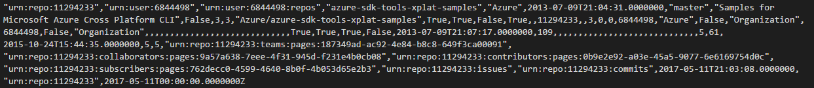
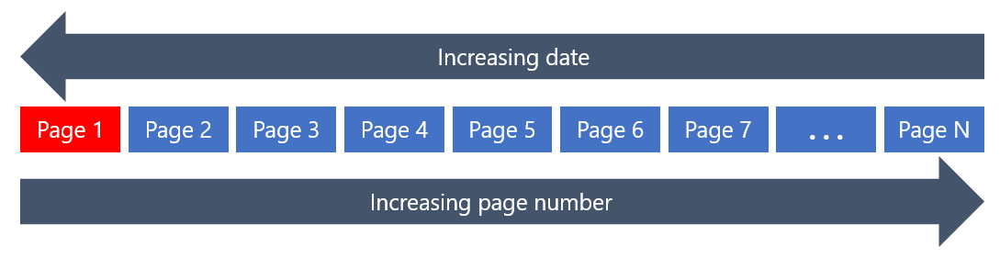
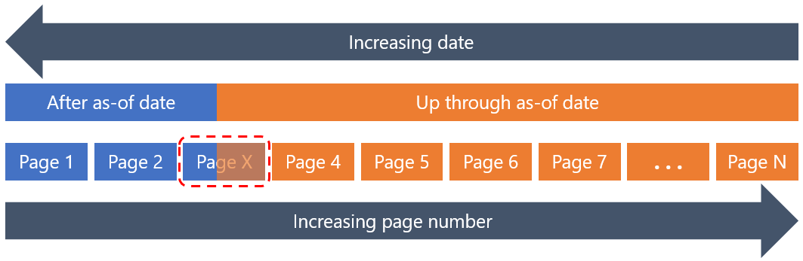
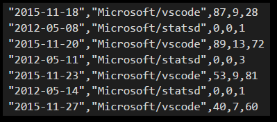

# GHCrawler data verification
This folder contains tools for verifying the completeness and accuracy of the data
being accumulated by GHCrawler. These tools compare current results from the GitHub V3 APIs
with data in the GHInsightsMS data set, in the box labeled _Data Verification_ in this diagram:


The CSV files in the _/TabularSource2_ folder of the _ghinsightsms_ ADLS account are generated each
day by Data Lake U-SQL scripts, and those CSV files are then ingested into a tabular cube in SQL
Server Analysis Services (SSAS). We compare those CSV files with the current results
returned by the GitHub API, and generate reports that summarize any differences found.

## repo verification

The [repodiff.py](https://github.com/Microsoft/ghcrawler-datalake-etl/blob/master/verification/repodiff.py)
script checks for extra or missing repos, following the steps outlined below.

### Step 1: Download current Repo.csv file from ADLS

The _Repo.csv_ file contains one row for each repo in all of the orgs that have been ingested into ADLS. Here's an example of a row from this file:



### Step 2: Get GitHub API results for every repo

Next we scan all of the repos in every org listed in the [orgs.txt](https://github.com/Microsoft/ghcrawler-datalake-etl/blob/master/verification/data/orgs.txt) file and writes a file to the
_data_ folder named _repo-github-YYYY-MM-DD.csv_, which contains these four columns: owner_login (i.e., the GitHub org), name (repo name), id (the GitHub ID for this repo), and created_at (ISO date string).

This file contains the expected set of repos that should exist in the ADLS data set.

### Step 3: Generate the diff report

The final step is to scan through the two data files from steps 1 and 2 and generate a CSV report file that shows which repos are missing from ADLS and which extra repos appear in ADLS but do not appear in the current GitHub API results. This file is written to the _data-verification_ folder, and is named _repodiff-YYYY-MM-DD.csv_.

You can find an example of the repo diff report [here](https://github.com/Microsoft/ghcrawler-datalake-etl/blob/master/verification/data-verification/repodiff-2017-05-11.csv). Status information is displayed on the console and also logged to the _repodiff.log_ file in the _data-verification_ folder, as shown [here](https://github.com/Microsoft/ghcrawler-datalake-etl/blob/master/verification/data-verification/repodiff.log).

## counting commits and issues

For commits and issues, the sheer number of entities to be compared makes it impractical to crawl the GitHub APIs for every entity. As an example, we're currently crawling a few thousand repos for the Microsoft orgs, but there are over a million total commits and issues across these repos. It's not feasible to hit the GitHub APIs that many times to verify the data, so we check repo-level _counts_ rather than comparing individual entities. Then, if discrepancies are found, we can research those specific repos to determine what's missing or what needs to be re-crawled.

To efficiently determine the number of commits or issues in a repo, we take advantage of the fact that the GitHub V3 API returns entities in reverse chronological order, organized into same-sized pages. Here's a high-level of what is returned by the [commits](https://developer.github.com/v3/repos/commits/) or [issues](https://developer.github.com/v3/issues/) endpoints of the GitHub API:



Only the first page is returned on the first API call, but it includes in the header a link to the last page. We use a page size of 100 (the highest allowed), so in this case we can determine the total number of commits or issues with just two API calls:

* First, call the API to get Page 1.
* Second, call the API to get the last page, Page N.

Then the total number of commits with be _100 * (N -1) + (# of entities in Page N)_.

That gives a total as of the moment the API is called, but for data verification purposes we're usually working with an ADLS data set that was ingested at the end of the previous business day. So we need to use a slightly more complex algorithm, based on an "as-of date" as shown here:



Here's an overview of the algorithm used in [audit.py](https://github.com/Microsoft/ghcrawler-datalake-etl/blob/master/verification/audit.py) to determine the number of commits or issues as of a specified date:

* Get Page 1; are entities on (or before) the as-of date included in it?
* If not, get subsequent pages until we find the a page that includes entities on or before the as-of date; note that this is Page X in the diagram above.

Now we can calculate the total count as follows:

_(# entities on or before as-of in Page X) + 100 * (N - X - 1) + (# entities on Page N)_

In actual practice, this usually requires just two API calls, because the as-of date is usually _yesterday_, and few projects have over 100 commits or issues in a single day. Occasionally an extremely busy repo requires 3 API calls, and we've never needed more than that to get a total count, even in repos with tens of thousands of commits or issues.

Pulling it all together, here's what happens when [audit.py](https://github.com/Microsoft/ghcrawler-datalake-etl/blob/master/verification/audit.py) runs to audit the number of commits and issues for each repo:

### Step 1: Download the daily totals from ADLS

We download the _verification_activities_repo.csv_ file from ADLS, which is generated each day by a U-SQL script and includes daily totals for each repo's issues, commits, and pull requests. Here's an example of a few lines from this file:



### Step 2: aggregate the daily totals into repo totals

The _dailytotals()_ function in [audit.py](https://github.com/Microsoft/ghcrawler-datalake-etl/blob/master/verification/audit.py) generates a _repototals-YYYY-MM-DD.csv_ file in the _data-verification_ folder, which contains the totals for each repo.

### Step 3: generate diff reports for commits and issues

The final step is to get counts for each repo on the as-of date (using the algorithm covered above), and generate report files summarizing any differences found. Here are two examples of the output report files:

* [audit_commits_2017-05-10.csv](https://github.com/Microsoft/ghcrawler-datalake-etl/blob/master/verification/data-verification/audit_commits_2017-05-10.csv)
* [audit_issues_2017-05-10.csv](https://github.com/Microsoft/ghcrawler-datalake-etl/blob/master/verification/data-verification/audit_issues_2017-05-10.csv)

## other source files

All of the data verification scripts need to work with the GitHub API and Azure Data Lake, and also have common needs for working with CSV files and so on. This shared functionality is in [shared.py](https://github.com/Microsoft/ghcrawler-datalake-etl/blob/master/verification/shared.py), which is imported by the other scripts.

in the past, the OSPO team has handled a variety of ad-hoc reports and analyses related to data verification, and all of that code is in [miscellaneous.py](https://github.com/Microsoft/ghcrawler-datalake-etl/blob/master/verification/miscellaneous.py). The details of this code are the scope of the data verification activities covered here, but it is included for future reference if needed.

## authentication

These programs require authentication for Azure Data Lake access
(via Azure Active Directory) and the GitHub API (via a username/personal access token).
Credentials are stored in a local file named _ghiinsights.ini_ that is stored in a
sibling folder (subdir of the parent) named __private_.

A template for setting up your INI file can be found here: [ghinsights.ini](https://github.com/Microsoft/ghcrawler-datalake-etl/blob/master/verification/misc/ghinsights.ini)

## installation

To install the data verification scripts, follow these steps:

* Install the latest version of Python from [Python.org](https://www.python.org/). Be sure the check the box to add Python to the path, or if you prefer you can leave that un-checked and use a virtual environment. (The use of virtual environments is not covered here &mdash; if you're not familiar with them, just add Python to your path to run these scripts.)
* Clone the repo: ```git clone https://github.com/Microsoft/ghcrawler-datalake-etl.git```
* Configure the ghinsights.ini file (found in the _misc_ folder) and then put it in a folder named _..\private_ relative to the root folder of the project
* Edit the _orgs.txt_ file in the data folder, to add the GitHub organizations you're crawling/verifying
* Install the Python package dependencies: ```pip install -r requirements.txt``` in the root folder. NOTE: if you're on a platform that comes with Python pre-installed, you'll need to use the command ```pip3``` instead of ```pip```.

You should then be able to run the programs with these commands:

* ```python repodiff.py``` = run the repo report
* ```python audit.py``` = run the commits and issues reports

NOTE: if you're on a platform that comes with Python pre-installed, you'll need to use the command ```python3``` instead of ```python```.
