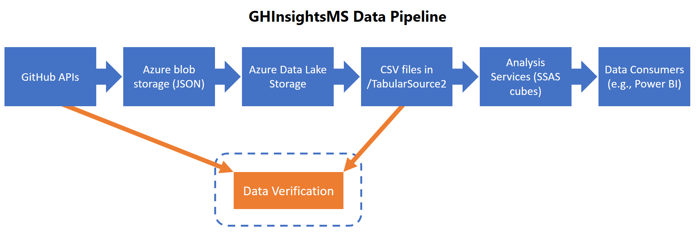

# GHCrawler data verification
This folder contains tools for verifying the completeness and accuracy of the data
being accumulated by GHCrawler. These tools compare current results from the GitHub V3 APIs
with data in the GHInsightsMS data set, in the box labeled _Data Verification_ in this diagram:



The CSV files in the _/TabularSource2_ folder of the _ghinsightsms_ ADLS account are generated each
day by Data Lake U-SQL scripts, and those CSV files are then ingested into a tabular cube in SQL
Server Analysis Services (SSAS). We compare those CSV files with the current results
returned by the GitHub API, and generate reports that summarize any differences found.

w## repo verification

/// repodiff.py
/// link to examples in data-verification folder

## counting commits and issues

/// frame the problem

/// counting-paged-entities.pptx

/// audit.py
/// link to examples in data-verification folder

## source files

/// brief description of each .py file

## authentication

/// rename ghiverify - ghinsightsms.ini

/// put a sample ini file in the misc folder

These programs require authentication for Azure Data Lake access
(via Azure Active Directory) and the GitHub API (via a username/personal access token).
Credentials are stored in a local file named _ghiverify.ini_ that is stored in a
sibling folder (subdir of the parent) named __private_. Here is an example of the
structure of the INI file:

```
[github]
username = xxxxxxxx
pat = xxxxxxxxxxxxxxxxxxxxxxxxxxxxxxxxxxxxxxxx

[azure]
subscription = xxxxxxxx-xxxx-xxxx-xxxx-xxxxxxxxxxxx
adls-account = xxxxxxxxxxx

[aad]
tenant-id = xxxxxxxx-xxxx-xxxx-xxxx-xxxxxxxxxxxx
client-secret = xxxxxxxxxxxxxxxxxxxxxxxxxxxxxxxxxxxxxxxxxxx=

client-id = xxxxxxxx-xxxx-xxxx-xxxx-xxxxxxxxxxxx
```

## installation

/// git clone

/// create folders: data, data-verification, ..\_private

/// install python and dependencies
